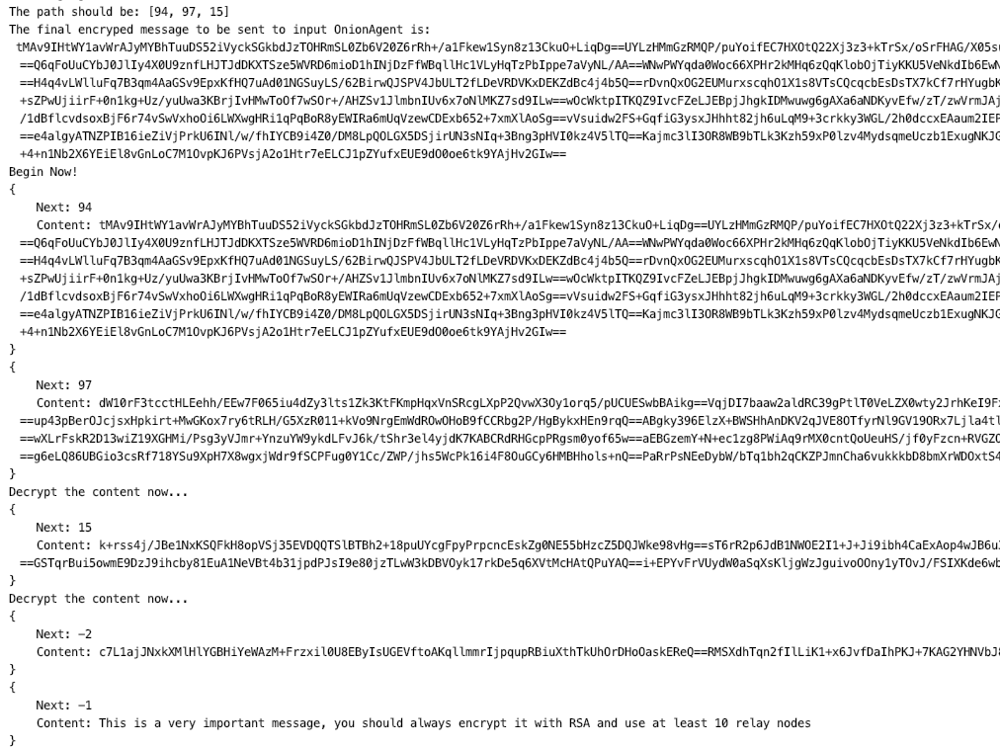

# Onion Simulator
This is a small project to simulate the Onion protocol. 

## Demo
Clone the repo and run `Driver.java`

The program will create 100 nodes that can relay message. We can randomly select some nodes, say 15 nodes, to pass a message from A to B. 

## How it works
Suppose A wants to pass message M to B through nodes [a, b, c], A will encrypt the message using the public keys of [c, b, a]:

```
M = encrypt(M, next='no next', PK(B))
M = encrypt(M, next='B', PK(c))
M = encrypt(M, next='c', PK(b))
M = encrypt(M, next='b', PK(a))
```

Now we send the encrypted message M to node `a`, which has private key SK(a) to decrypt the message and see who is the next node.

```
M, next = decrypt(M, SK(a))
(next is 'b')
```

Now `a` pass the message to `b`, and so on

```
M, next = decrypt(M, SK(b)) (next is 'c')
M, next = decrypt(M, SK(c)) (next is 'B')
M, next = decrypt(M, SK(B)) 
```

M should be fully decrypted now, and next reaches B.